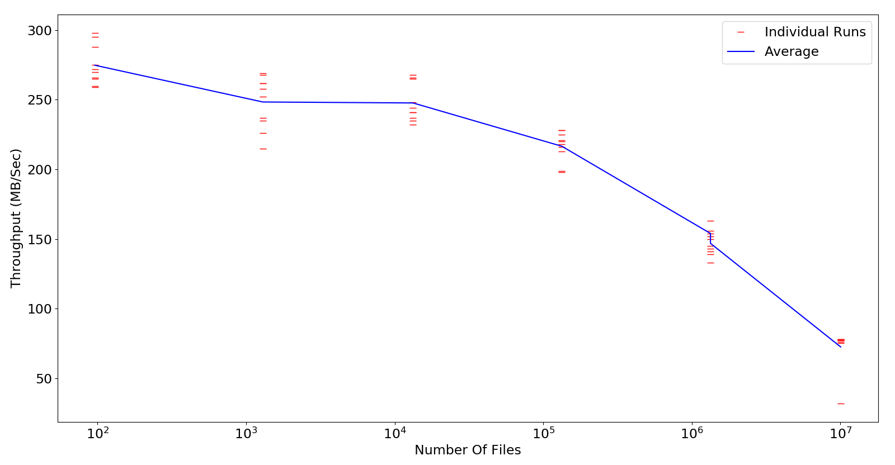
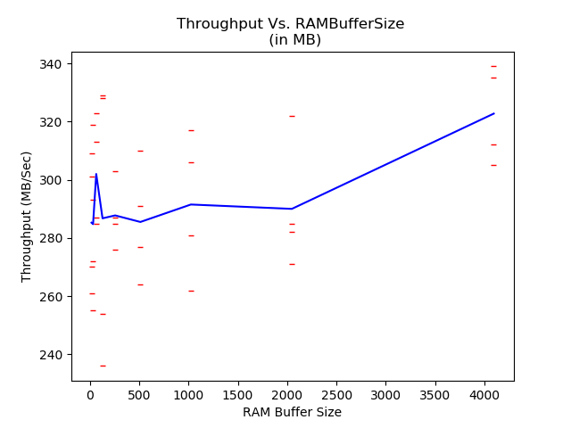
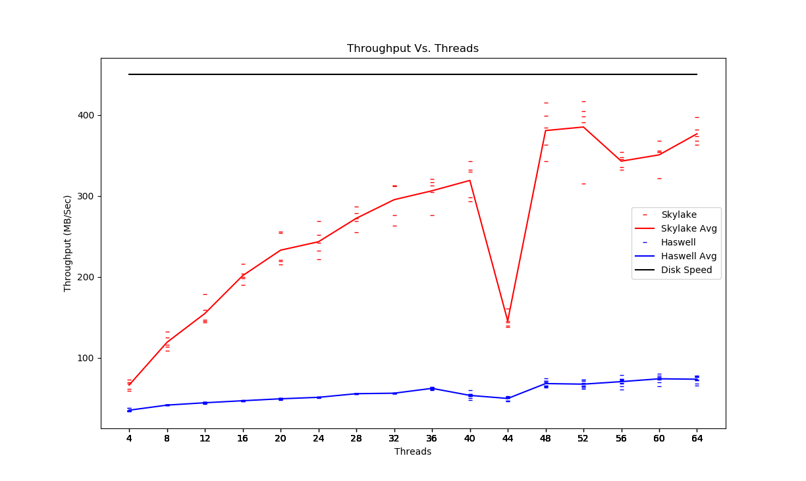
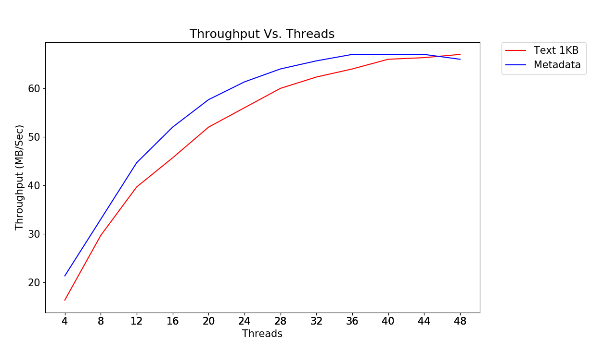

# XSearch - Evaluating the Performance of Metadata Indexing in Large Scale Storage Systems
(http://datasys.cs.iit.edu/projects/xsearch/index.html)
## Single-node Implementation:
  * Apache Lucene
  * Lucene++
  * Clucene
  * Database

## Steps: 
1. Split the Metadata into chunks of 10,000 , 100,000, 1 Million and 10 Million
2. Use Indexer and Searcher using Lucene with Java and Luceneplusplus with C++
3. Parameter tuning over NoBufferedDocs , RAMBufferSize and Threads
4. Compare results from Lucene and Lucene Plus plus. 

#### Lucene Architecture
(url)

## Experiment Results

